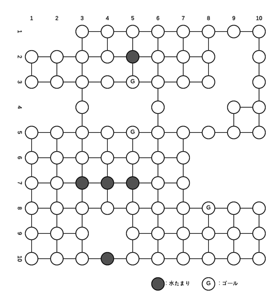

#2016年度　確率ロボティクス課題
　このリポジトリは，確率ロボティクスの課題用のリポジトリである．

##第8回スライド問題回答
　アルゴリズムの確認，プログラム作成などの練習の意味も兼ねて，第8回講義の問題を解いた．解いた結果はTravisCIで表示する.  
各問題のグラフの環境は，src内の~data.txtから与えられる.  
---「~data.txt」内の意味---  
`-1 -100`     //一つ目の数字は各移動にかかるコスト，二つ目の数字は水たまりのペナルティ(ない場合は0を記入).  
`3 4`          //一つ目の数字はグラフの横の数，二つ目の数字はグラフの縦の数  
`3 3 1`       //グラフ左上から順番に並んでる　  
`0 0 0`       // 各数字の意味:0:何もない 1:ゴール 2:水たまり 3:立ち入り禁止エリア  
`0 2 0`  
`0 0 0`  
  プログラムを実行すると読み込んだグラフデータをもとに，初期の価値を表示する．`--START--`が表示されてからは，各要素を一巡したら価値を表示する．最後に収束したら`--end--`を表示する．ゴールは`0`または`0.0`が表示される．  
  
1.　問題1  
https://travis-ci.org/KenshiroHosaka/16ProbabilisticRobotics/builds/198312556  
2.　問題2  
R=1 :https://travis-ci.org/KenshiroHosaka/16ProbabilisticRobotics/builds/198453786  
R=10:https://travis-ci.org/KenshiroHosaka/16ProbabilisticRobotics/builds/198454162  
3.　問題3    
https://travis-ci.org/KenshiroHosaka/16ProbabilisticRobotics/builds/198454655  
4.　問題4  
R=1   :https://travis-ci.org/KenshiroHosaka/16ProbabilisticRobotics/builds/198455028  
R=10  :https://travis-ci.org/KenshiroHosaka/16ProbabilisticRobotics/builds/198455276  
R=100 :https://travis-ci.org/KenshiroHosaka/16ProbabilisticRobotics/builds/198455434  
5.　問題5  
https://travis-ci.org/KenshiroHosaka/16ProbabilisticRobotics/builds/198455935    

##発展課題  
　発展課題として以下のグラフの有限MDP問題を解く.  
 
+ 移動にかかるコストは「-1」
+ 水たまりに入るときのコストは「-100」
+ 第8回スライド中の問題3と同様の遷移条件  
  

  
##解説  
　発展課題は問題5のプログラムを使用した．ゴールは`G`と表示される．  
 結果：https://travis-ci.org/KenshiroHosaka/16ProbabilisticRobotics/builds/198888392    

  ソースコードの大まかな流れ  
  
1.  ファイルを読み込む 
2.  価値を代入する二次元配列(層)をコストよりものすごく小さい値(COSTの10000倍)で埋める．水たまり用，ゴール用の位置を示すための二次元配列(層)も用意する．後での計算を楽にするために計算するところよりも一回り大きな配列を用意する．
3.  読み込んだデータをもとに価値の層に初期の価値(-100.0)を代入していく．ゴールの場合は価値の層に0.0を代入し，ゴールの層にフラグを立てる．水たまりの場合は初期の価値を代入しつつ水たまりの層にペナルティを代入する．3があったら立ち入り禁止エリアなので価値の層にCOSTの10000倍を代入する．
4.  価値反復を用いて価値の各要素を計算しなおしていく.ゴールまたは禁止エリアではないことを確認したら価値の更新の計算に入る
	1.  自身の位置から上下左右への遷移後の価値をそれぞれ計算
	2.  禁止エリアを除外しつつ移動可能な方向が何方向かカウント
	3.  カウントした数を元に遷移条件を踏まえた価値に更新
	4.  一番高い価値を自身の価値の層に代入
	5.  ゴールの場合）価値の更新はせずに価値を表示
	6.  禁止エリアの場合） 空白を表示する  
5.  価値の層の各要素が前回の価値と同じ値だった場合をカウントし，ゴール，禁止エリアの数を足して二次元配列の数と同じになったらループ終了
